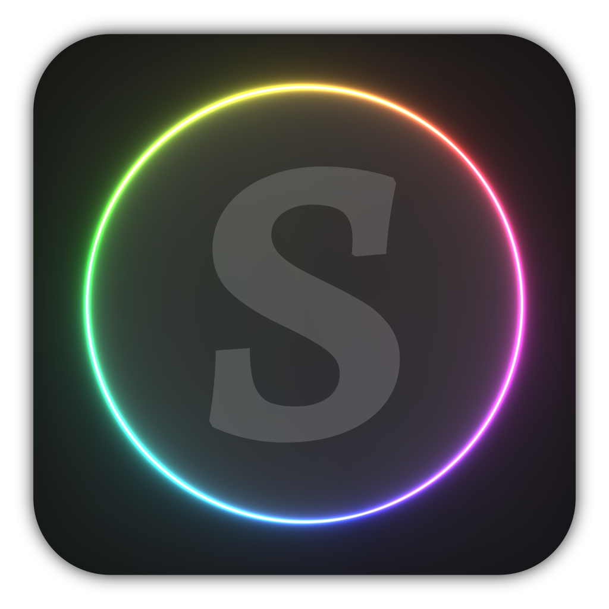

【☰】Table of Contents 👆

<div align="justify">

<div align="center">
  

  <h1>ShaderFlow</h1>

  
  
  
  
  <a href="https://t.me/brokensource">
    
  </a>
  <a href="https://discord.gg/KjqvcYwRHm">
    
  </a>

  <sub> 👆 Out of the many **Explorers**, you can be among the **Shining** stars who support us! ⭐️ </sub>

  <br>

  Imagine **[**[**ShaderToy**](https://www.shadertoy.com)**]**, on a **[**[**Manim**](https://github.com/3b1b/manim)**]**-like Architecture. That's **[**[**ShaderFlow**](https://github.com/BrokenSource/ShaderFlow)**]**.
</div>

<br>

# 🔥 Description

> ShaderFlow is a complete **Tool** for **Artists**, **Musicians** and **Shader Enthusiasts**

A **Framework** for Creating, Exporting **Real Time** and **Audio Reactive** Shaders

- **🛡️ Open Source**, Trust and Transparency, Cross Platform, Configurable
- **🧸 80% ShaderToy** Compatible, Easily transfer your Knowledge
- **🚀 Physics-like** Animations with Control Systems Dynamics
- **🔱 High Quality**, Any Resolution, Framerate, Bitrate, SSAA
- **🎵 Audio Reactive**, Live Music, Professional Video
- **🌊 Audio Waveforms** and Oscilloscope Support
- **🎥 Video as Texture**: Real Time 4k Processing
- **🎨 No Watermarks**, User First Experience
- **🌵 Fastest** Rendering times in the West
- **👁 Built-in Camera** 2D, 3D, 360°, VR
- **🎹 Piano Roll** scene, the smoothest


<br>
<br>

# 📸 Showcase

🎧 • Remember to Enable Audio on the Videos !

<br>

https://github.com/BrokenSource/ShaderFlow/assets/29046864/1170d916-2145-4655-b0d0-c2ee5b16839f

<sup><b>Video:</b> Music Visualizer Tech Demo Scene. <b>Sources:</b> <a href="https://www.youtube.com/watch?v=6FNHe3kf8_s">Music</a> and <a href="https://wallhaven.cc/w/pkz5r9">Image</a>. Property of their original owners ⚖️</sup>

<br>

https://github.com/BrokenSource/ShaderFlow/assets/29046864/9f0e7517-048c-4145-abfe-9a30ecc7323a

<sup><b>Video:</b> Music Bars Tech Demo Scene. <b>Sources:</b> <a href="https://www.youtube.com/watch?v=UHUZiVXdaUI">Music</a>. Property of their original owners ⚖️</sup>

<br>

https://github.com/BrokenSource/ShaderFlow/assets/29046864/cef10b0f-a1a0-444c-abca-d3c630349741

<sup><b>Video:</b> Real Time Piano Roll Tech Demo Scene. <b>Sources:</b> <a href="https://freepats.zenvoid.org/Piano/acoustic-grand-piano.html">Salamander Grand Piano</a> by Alexander Holm, CC BY 3.0 and <a href="https://bitmidi.com/rimsky-korsakov-flight-of-the-bumblebee-mid">Midi File</a> for the composition Flight of The Bumblebee by Rimsky Korsakov. Property of their original owners ⚖️</sup>

<br>

https://github.com/BrokenSource/ShaderFlow/assets/29046864/7ff7f6fa-19d1-4de1-a4be-89177d3fea01

<sup><b>Video:</b> Educational Scene about Parallel Plates Capacitor. <b>Source:</b> Coded myself long ago.</sup>


<br>
<br>

# 📦 Installation

**ShaderFlow**, similar to [**Manim**](https://github.com/3b1b/manim), is best used directly from a `python` script

<br>

> 🔴🟡🟢&nbsp; **For Extra Installation Help**, check out the [**Monorepo**](https://github.com/BrokenSource/BrokenSource#-running-from-the-source-code)
>
> - **🐧 Linux and MacOS 🍎**: Open a Terminal in some Folder and run:
>   ```ps
>   /bin/bash -c "$(curl -sS https://brakeit.github.io/get.sh)"
>   ```
>
> - **💠 Windows**: Open a PowerShell in some Folder and run:
>   ```ps
>   irm https://brakeit.github.io/get.ps1 | iex
>   ```
>
> <sub><b>Note:</b> The commands above are safe. You can read what they do <b><a href="https://github.com/Brakeit/brakeit.github.io">here</a></b>.</sub>

<br>

After you are inside the Development Environment:

- Run `broken shaderflow` to see all available scenes

- Run `broken shaderflow (scene)` to run a specific scene

- Run `broken shaderflow (scene) --help` for rendering options

**Scene files** are placed under `ShaderFlow/Resources/Scenes/**/*.py`

<br>
<br>

# 🎮 Controls

**Camera Modes**
- <kbd>1</kbd>: Free Camera 3D
- <kbd>2</kbd>: Generic Camera 2D
- <kbd>3</kbd>: Spherical Camera 3D
- <kbd>p</kbd>: Camera Projection
- <kbd>i</kbd> <kbd>j</kbd> <kbd>k</kbd>: UP Axis (x, y, z)

<br>

**Camera Controls**
- <kbd>W</kbd> <kbd>A</kbd> <kbd>S</kbd> <kbd>D</kbd>: Move
- <kbd>Q</kbd> <kbd>E</kbd>: Roll
- <kbd>Space</kbd> <kbd>Shift</kbd>: Move Up/Down
- <kbd>Mouse</kbd>: Look Around
- <kbd>Mouse Wheel</kbd>: Zoom In/Out
- <kbd>T</kbd> <kbd>G</kbd>: Isometric +/-

<br>

**Window Controls**:
- <kbd>Tab</kbd>: ShaderFlow Menu
- <kbd>F1</kbd>: Exclusive Mouse Mode
- <kbd>F2</kbd>: Screenshot
- <kbd>F11</kbd>: Fullscreen
- <kbd>Esc</kbd>: Exit


<br>
<br>

# ⚖️ License

**See [BrokenSource](https://github.com/BrokenSource/BrokenSource) Repository** for the License of the Code, Assets, Projects and User Generated Content

</div>